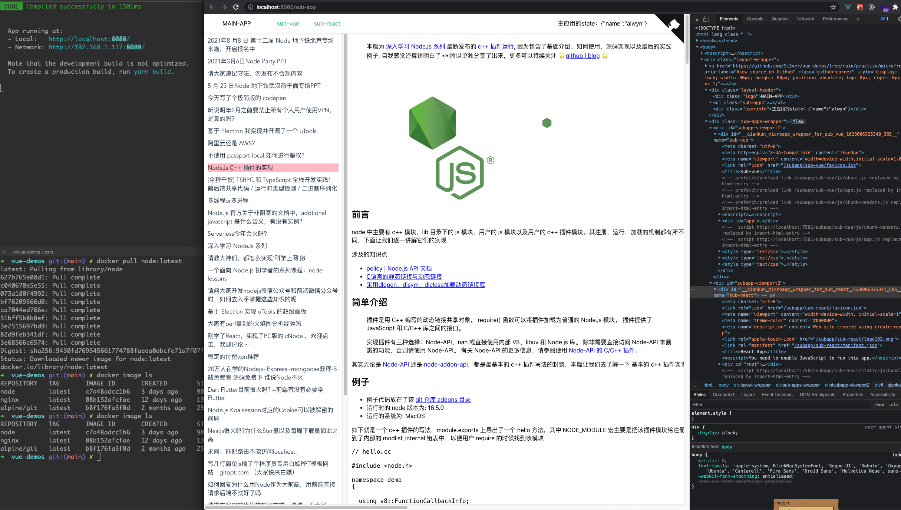
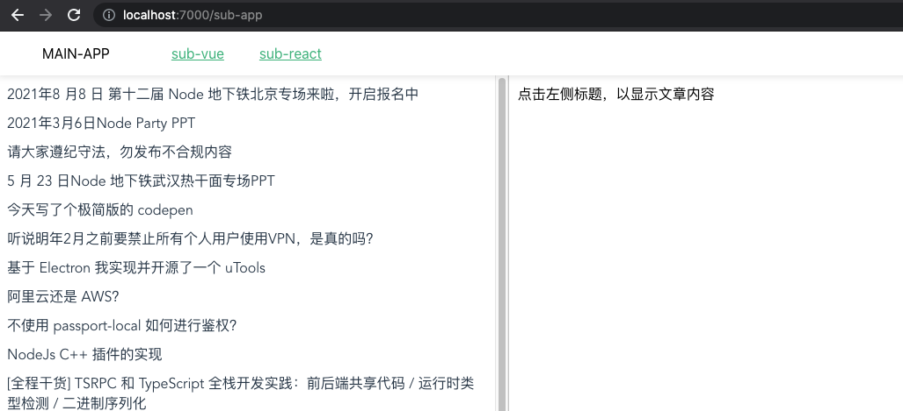

# 模块二：前端工程化 (二)

## 作业

### 0729

> 微前端

**题目**

用微前端框架实现一个阅读网站，左侧点击文章，右侧显示文章详情。

+ [项目地址](../../practise/qiankun/README.md)
+ [父应用](../../practise/microfrontend/README.md)
+ [子应用A](../../practise/microfrontend/sub-vue/README.md)
+ [子应用B](../../practise/microfrontend/sub-react/README.md)

**本地启动方式**
1. 切换到项目地址 `cd practise/microfrontend`
2. 安装项目依赖 `yarn`
3. 启动项目 `yarn start`
4. 浏览器打开 http://localhost:8080/sub-app

### 0731

将 7 月 29 日的微前端作业，在 Docker 或 Docker Compose 中运行。

<!-- **解答**
1. 拉取镜像 `docker pull node:latest`
2. 进入docker宿主机 `docker run -it --rm node bash`
3. 拉取git源代码 `git clone https://github.com/Si3ver/vue-demos.git`
4. 切换到项目目录 `cd vue-demos/practise/microfrontend`
5. 安装依赖 `npm instal`
6. 启动项目，端口为docker的8080端口 `npm start`
7. 给运行中的docker增加端口映射，新开一个terminal `docker` -->

**docker启动方式**
1. 切换到项目地址 `cd practise/microfrontend`
2. 打包本地镜像 `docker build . -t myserver`
3. 启动容器 `docker run -d -p 7000:8080 -p 7501:7501 -p 7502:7502 myserver`
4. 浏览器打开 http://localhost:7000/sub-app

