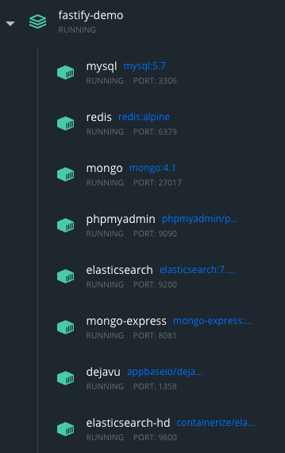

# 我的第一个 fastify server 项目

> [起步文档](https://www.fastify.io/docs/latest/Getting-Started/)

## 启动方式

Step 1: 修改插件 plugin/elasticsearch.js ip地址为本机ip

Step 2: 打开 docker 软件

Step 3: 运行 `docker-compose up`，启动 services

+ MySQL: http://127.0.0.1:3306
+ Redis: http://127.0.0.1:6379
+ MongoDB: http://127.0.0.1:27017
+ ElasticSearch: http://127.0.0.1:9200
+ PhpMyAdmin: http://127.0.0.1:9090
+ Mongo-Express: http://127.0.0.1:8081
+ ElasticHD: http://127.0.0.1:9800
+ dejavu: http://127.0.0.1:1358



Step 4: `yarn init-mongo`

Step 5: 启动应用 http://127.0.0.1:9700

```sh
$ yarn
$ yarn start
```

Step 5: 访问应用

**api接口**
+ http://127.0.0.1:9700/hello
+ http://127.0.0.1:9700/animal


**mongodb**
+ [文档](https://github.com/fastify/fastify-mongodb)
+ 可视化 Mongo-Express http://127.0.0.1:8081
+ 插入数据 http://127.0.0.1:9700/todo/add
+ 查询数据
  - http://127.0.0.1:9700/todo/query?state=0
  - http://127.0.0.1:9700/todo/query?state=1


**Redis**
+ [文档](https://github.com/fastify/fastify-redis)
+ 存入redis http://127.0.0.1:9700/redis/set?name=william
+ 读取数据   http://127.0.0.1:9700/redis/get/name


**MySQL(需要先手动建一张表 todos.todos)**
+ [文档](https://github.com/fastify/fastify-mysql)
+ 可视化 PhpMyAdmin http://127.0.0.1:9090
+ 插入数据 http://127.0.0.1:9700/mysql/insert
+ 查询数据 http://127.0.0.1:9700/mysql/query


**elastic search**
+ [文档](https://github.com/fastify/fastify-elasticsearch)
+ 可视化 ElasticHD http://127.0.0.1:9800
+ 插入数据 http://127.0.0.1:9700/es/add
+ 搜索数据 http://127.0.0.1:9700/es/get

